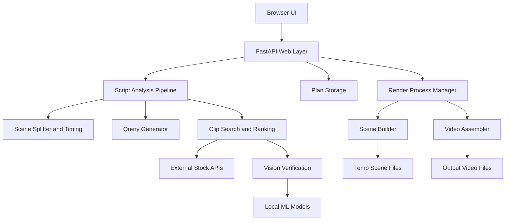
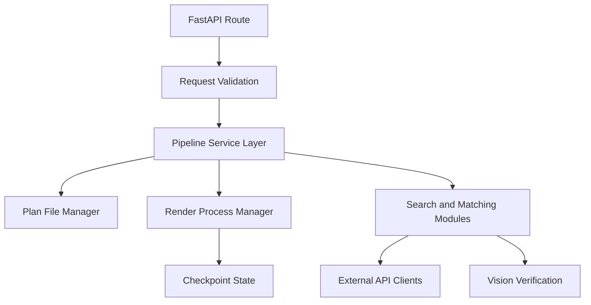
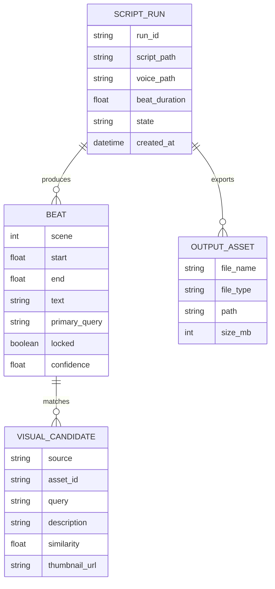

## 1. Architecture Design


## 2. Technology Description
- Frontend: Server-rendered HTML/CSS/JavaScript first, with a path to migrate to React if a richer timeline editor is needed later
- Initialization Tool: Existing Python application structure, no separate JS build system required for MVP
- Backend: FastAPI + Uvicorn
- Processing Engine: Existing local Python pipeline modules for analysis, alignment, search, scene building, and export
- Media Stack: ffmpeg via `imageio-ffmpeg`
- ML / Matching: Faster Whisper for voice alignment, CLIP-based vision verification for image/video ranking
- Storage: Local filesystem JSON and generated files; no database required for MVP
- External Services: Pexels API and Pixabay API for stock footage discovery

## 3. Route Definitions
| Route | Purpose |
|-------|---------|
| `/` | Main AI editing workspace |
| `/api/analyze` | Accept script and optional voiceover, generate timed beat plan and editable queries |
| `/api/plan` | Save user overrides to generated beat queries or locked matches |
| `/api/render` | Start local rendering using current approved plan |
| `/api/stop` | Stop an active render process |
| `/api/progress` | Return current processing state, completed beats, and total beats |
| `/api/outputs` | List recent output videos and audit assets |
| `/outputs/{name}` | Download a finished render |

## 4. API Definitions
```ts
type BeatPlanItem = {
  scene: number;
  start: number;
  end: number;
  text: string;
  keywords: string[];
  confidence?: number;
  locked?: boolean;
  candidates?: VisualCandidate[];
};

type VisualCandidate = {
  source: "pexels" | "pixabay";
  video_id: string;
  query: string;
  desc: string;
  sim: number;
  thumb?: string;
};

type AnalyzeResponse = {
  scenes: BeatPlanItem[];
  duration: number;
};

type RenderRequest = {
  scene_duration: number;
  cards: boolean;
  sfx: boolean;
  vision: boolean;
  motion: boolean;
};

type ProgressResponse = {
  state: "idle" | "rendering" | "done" | "error";
  done: number;
  total: number;
};
```

## 5. Server Architecture Diagram


## 6. Data Model
### 6.1 Data Model Definition


### 6.2 Data Definition Language
No SQL schema is required for MVP because the tool is local-first and file-backed.

Planned filesystem artifacts:

```text
my_scripts/ui_script.txt
my_scripts/ui_voiceover.mp3
my_scripts/ui_plan.json
temp/progress.json
output/<script>_<timestamp>.mp4
output/audit/*
```

Recommended implementation notes:
- Change the current analysis default from 6-second scene export to 3-second beat export for this product mode.
- Extend the plan JSON schema to carry confidence score, candidate previews, and a locked-selection marker.
- Keep all long-running render work in a subprocess so the FastAPI server remains responsive.
- Preserve checkpoint-based resume behavior so failed or interrupted renders continue cleanly.
