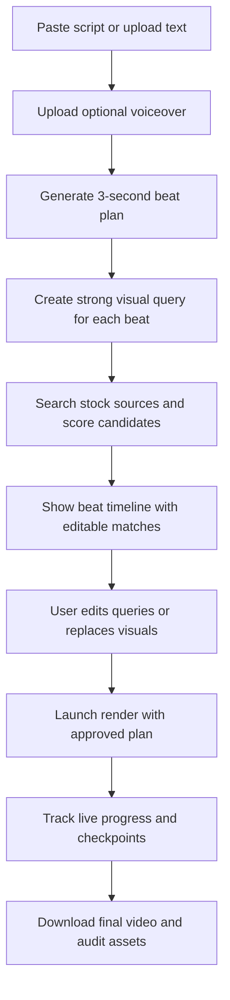

## 1. Product Overview
AI Editing Tool is a desktop-first local web app where a creator pastes a script, optionally uploads voiceover, and gets a timed visual plan with matching stock footage for the whole script at roughly 3-second intervals.
- Solves the slow manual workflow of breaking a script into beats, inventing search phrases, browsing stock footage, and keeping visuals aligned with narration.
- Targets solo creators, faceless YouTube editors, short-documentary makers, and agencies that need faster first-cut visual assembly with editable control.

## 2. Core Features

### 2.1 User Roles
| Role | Registration Method | Core Permissions |
|------|---------------------|------------------|
| Local Creator | No login; local app session | Paste scripts, upload voiceover, generate beat plan, edit search prompts, render and download outputs |

### 2.2 Feature Module
1. **Workspace Page**: script input, voiceover upload, generation controls, beat duration controls
2. **Beat Plan Page**: timeline list, per-beat text, generated visual query, candidate visual matches, quick replace controls
3. **Render & Output Page**: progress tracking, output browser, audit review, export and download actions

### 2.3 Page Details
| Page Name | Module Name | Feature description |
|-----------|-------------|---------------------|
| Workspace Page | Script Input | Accept pasted narration script or uploaded text file |
| Workspace Page | Voiceover Upload | Accept optional narration audio to align cuts and captions to actual speech |
| Workspace Page | Beat Settings | Let user choose beat duration with 3 seconds as the default for full-script visual matching |
| Workspace Page | Generate Action | Run script analysis, timing, and strong visual-query generation for the whole script |
| Beat Plan Page | Beat Timeline | Show every generated beat with index, start/end times, duration, and script excerpt |
| Beat Plan Page | Visual Query Editor | Let user edit the generated visual phrase for any beat before search or render |
| Beat Plan Page | Match Results | Show ranked candidate visuals per beat with source, confidence, and thumbnail preview |
| Beat Plan Page | Replace / Lock | Let user swap candidates, lock a chosen visual, or mark a beat for manual override |
| Beat Plan Page | Coverage Health | Flag weak matches, duplicate visuals, or low-confidence beats that need attention |
| Render & Output Page | Render Controls | Start, stop, and resume rendering using the approved beat plan |
| Render & Output Page | Live Progress | Display processed beats, expected total, current state, and completion estimate |
| Render & Output Page | Output Browser | List finished videos, audit assets, and downloadable result files |

## 3. Core Process
The creator pastes a script, optionally uploads a voiceover, and clicks generate. The system splits the script into approximately 3-second beats, preserving sentence sense where possible while respecting narration timing. For each beat, the analyzer produces a strong visual query, the clip search layer finds candidate visuals, and the ranking layer returns the best match. The user reviews the beat plan, edits weak queries, swaps visuals where needed, and then launches the render/export flow. The system renders the video locally, tracks progress, and exposes finished outputs for download.

## 4. User Interface Design
### 4.1 Design Style
- Primary colors: charcoal black, graphite, warm ivory text, and electric amber accents for editorial contrast
- Button style: dense rounded-rectangle controls with premium studio-console weight
- Fonts: distinctive editorial display face for headings paired with a readable humanist sans for controls and body text
- Layout style: desktop-first split workspace with left-side input/control rail and right-side timeline/results canvas
- Icon style suggestions: cinematic, restrained line icons with subtle playback and storyboard metaphors

### 4.2 Page Design Overview
| Page Name | Module Name | UI Elements |
|-----------|-------------|-------------|
| Workspace Page | Script Input | Large code-like text area, drag-and-drop text import, sticky action bar, file chips |
| Workspace Page | Voiceover Upload | Audio upload field, waveform summary, duration badge, replace/remove action |
| Workspace Page | Beat Settings | Duration stepper, advanced toggles, source selectors, generation CTA |
| Beat Plan Page | Beat Timeline | Scrollable storyboard list, time badges, confidence states, inline edit controls |
| Beat Plan Page | Match Results | Thumbnail grid, similarity labels, source tags, select/replace buttons |
| Beat Plan Page | Coverage Health | Warning pills, duplicate alerts, low-confidence flags, review shortcuts |
| Render & Output Page | Live Progress | Progress bar, status chips, scene counters, recent log snippets |
| Render & Output Page | Output Browser | Export cards, file size, timestamp, audit links, download buttons |

### 4.3 Responsiveness
- Desktop-first layout is the default because reviewing dozens of beats and candidate visuals needs wide space.
- Tablet layout collapses the timeline and match panel into stacked sections while preserving editability.
- Mobile support is limited to light review of outputs and progress, not full production editing.
